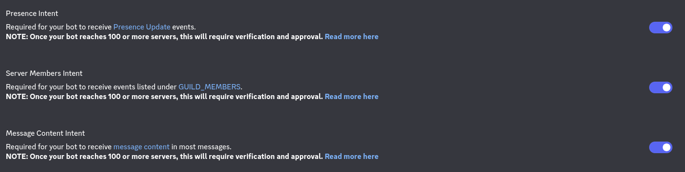

# BLVBot
BLV Bot - simple discord bot made by @unnamed_furry specifically for BLV Squad and PF Studio.

---

Current functional:
1. The **help/usage** command displays a list of available commands and their usage. Usage: `!help` or `!usage`.
2. The **ping** command checks the bot's operation and API latency. Usage: `!ping`.
3. The **avatar** command allows you to view and download the current avatar of the user you're interested in. Usage: `!avatar <user_id_of_interest>`, for example: `!avatar 897054945889644564`.
4. The **ban** command allows you to ban a user from the current server. Usage: `!ban <user_id_of_interest>`, for example: `!ban 897054945889644564`.
5. The **unban** command allows you to unban a user from the current server. Usage: `!unban <user_id_of_interest>`, for example: `!unban 897054945889644564`.
6. The **whitelistRole** command allows you to add the desired role to the list of verified roles, thereby allowing users with this role to use moderation commands (e.g. ban/unban). Usage: `!whitelistRole add/remove <role_id_of_interest>`, for example: `!whitelistRole add 1098250899551436820` or `!whitelistRole remove 1098250899551436820`.
7. The **kick** command allows you to kick the desired user on the server. Usage: `!kick <user_id_of_interest`, for example: `!kick 897054945889644564`.
8. The **timeout** command allows you to timeout the participant of interest. Usage: `!timeout 60s/5m/10m/1h/1d/1w <user_id_of_interest>`, for example: `!timeout 60s 897054945889644564`.

---
## How to create your bot?

You can read this guide: https://www.ionos.com/digitalguide/server/know-how/creating-discord-bot/.

After finishing these steps you should also allow bot to `Set bot's permissions to Administrator (in Bot tab)` and `Allow bot to read messages in all channels (enable all Presence Intents in Bot tab like in next image)`.

